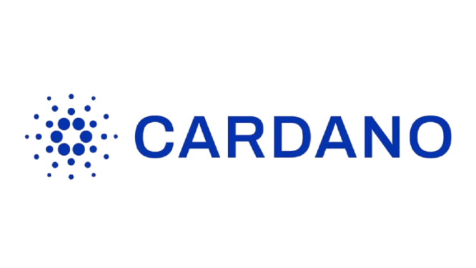
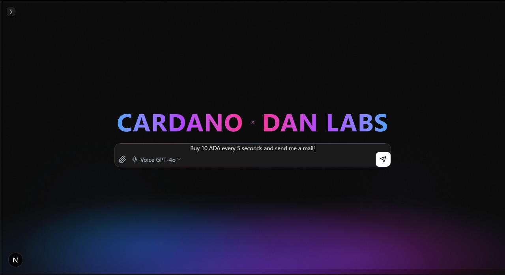
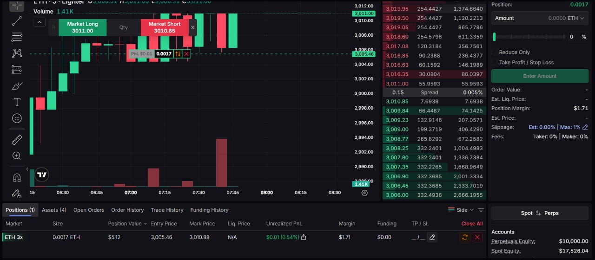

CARDANO × DAN LABS  

AI-powered trading agent that turns plain English like “buy 10 ADA every 5 seconds and send me a mail” into executable workflows, runs them on Cardano, and streams live trades and notifications in real time.

---

## 🌌 Hero Experience

The app opens with a full-screen “CARDANO × DAN LABS” hero, a glowing aurora background, and a single central prompt bar where the user can type or speak strategies such as “Buy 10 ADA every 5 seconds and send me a mail”.

Users see a chat-style history of all previously created agents and prompts on the left, so it feels like a trading copilot instead of a static form.

### Screenshots

Screenshot 1 – Initial hero screen with prompt:  

Screenshot 2 – Dashboard / workflow state:  

Additional view with live trading and charts:  

---

## 🎬 End-to-End Demo (Video)

GitHub does not reliably play inline `<video>` tags in all contexts, so the most robust approach is a clickable thumbnail that opens the MP4.

> Click the image above to open and play the demo video (public/6.mp4) in your browser.

---

On the left, users see a chat-style history of all previously created agents and prompts, making it feel like a trading copilot rather than a static form.

This project converts natural language strategies into strict JSON workflows (triggers, actions, edges).
It visualizes workflows as interactive graphs with animated nodes using React Flow.
Executes trades against configured providers (Cardano, Lighter, Masumi, etc.) and simulates when needed.  
Sends real-time HTML email notifications whenever a workflow runs.
Streams trade events live into a dashboard using Socket.IO.
At a high level, you talk to the system like an AI agent, it compiles your intent into a workflow, and then that workflow becomes a live trading strategy with full observability.

Natural-language → JSON workflow parsing with a local regex-based NLP engine.
Zero external AI requirement, with optional Gemini/OpenAI fallback.
Cardano integration via Blockfrost webhooks and a dedicated real-time server. 
Email alerts via Nodemailer, Gmail SMTP, and responsive HTML templates.
Animated, dark-mode trading canvas powered by TailwindCSS and custom shaders. 
Live dashboard with charts, trade history, and action statuses.
Persistent chat history stored in the browser, so each strategy is a “session” you can revisit.
✨ Core Features
Natural Language → JSON: Converts plain English prompts like "buy 10 ADA every 5 seconds" into structured workflows​

100% Local Parsing: Regex-based NLP parser - zero external AI API dependency​

Cardano Blockchain: Real-time transaction monitoring via Blockfrost webhooks​

Live Email Notifications: Nodemailer integration with professional HTML templates​

React Flow Visualization: Interactive workflow canvas with animated nodes​

Real-time Dashboard: Live charts, trade history, and WebSocket updates​

Multi-provider Support: Cardano, Backpack, Lighter, Masumi adapters​

Persistent Chat History: LocalStorage-backed conversation management​

📦 Quick Start
bash
git clone <your-repo>
cd ujesh2k-natural-json
npm install
npm run dev
Open http://localhost:3000​

Configure Email (.env.local):

text
SMTP_EMAIL=your-email@gmail.com
SMTP_PASSWORD=your-16-char-app-password
SMTP_SERVICE=gmail
🎯 API Endpoints
Method	Endpoint	Description
POST	/api/nlp	Parse prompt → JSON workflow ​
GET	/api/nlp	Get last workflow ​
POST	/api/execute	Execute workflow ​
POST	/api/email	Send notification ​
GET	/api/events	Live SSE stream ​
Example:

bash
curl -X POST http://localhost:3000/api/nlp \
  -H "Content-Type: application/json" \
  -d '{"prompt": "buy 10 ADA when price hits $0.50 and email me"}'
🏗️ Project Architecture
text
ujesh2k-natural-json/
├── README.md                    # Core docs
├── EMAIL_INTEGRATION_COMPLETE.md # Email setup
├── src/
│   ├── app/
│   │   ├── api/                 # All endpoints
│   │   │   ├── nlp/route.ts     # Regex parser
│   │   │   ├── cardano/route.ts # Blockchain
│   │   │   └── email/route.ts   # Notifications
│   │   └── page.tsx             # Main UI
│   ├── components/
│   │   ├── trading/             # Dashboards
│   │   ├── workflow/            # React Flow
│   │   └── ui/                  # Aurora shaders
│   ├── lib/
│   │   ├── localParser.ts       # Core NLP engine
│   │   ├── cardanoService.ts    # Blockfrost
│   │   └── emailService.ts      # Nodemailer
│   └── types/workflow.ts        # TypeScript interfaces
├── webhook-server.js            # Socket.IO + Blockfrost
└── package.json                 # Dependencies
Tech Stack: Next.js 16, TypeScript, TailwindCSS, @xyflow/react, Blockfrost, Nodemailer​

📊 Workflow Schema
typescript
interface Workflow {
  id: string;
  name: string;
  triggers: PriceTrigger[] | TimerTrigger[];
  actions: TradeAction[] | NotificationAction[];
  edges: { from: string; to: string }[];
}

interface PriceTrigger {
  id: string;
  type: "PriceTrigger";
  asset: string;      // "ADA", "BTC", "AAPL"
  operator: ">=" | "<=" | ">" | "<";
  value: number;
}

interface TradeAction {
  id: string;
  type: "TradeAction";
  side: "buy" | "sell" | "long" | "short";
  asset: string;
  amount: number;
  takeProfitPercent?: number;
  stopLossPercent?: number;
}
🎨 UI Flow
Prompt Input → Natural language strategy​

NLP Parser → Structured JSON workflow​

React Flow Canvas → Visual node graph​

Live Dashboard → Charts + trade execution​

Execution → Cardano trades + email alerts​

Aurora Shaders create immersive animated backgrounds. Custom nodes animate on hover.​

🔗 Integrations
Service	Status	Purpose
Blockfrost	✅ Live	Cardano tx monitoring ​
Nodemailer	✅ Live	Gmail SMTP emails ​
Socket.IO	✅ Live	Real-time updates ​
Lighter	🔄 Testnet	Trading execution ​
Gemini AI	🔧 Optional	Fallback parser ​
🚀 Test Workflows
text
✅ "buy 10 ADA every 5 seconds and email me"
✅ "when ADA hits $0.50 buy 100 ADA"
✅ "long BTC 10x if price > $50k"
✅ "short NIFTY at 22000, TP 5%, SL 2%"
✅ "buy 0.5 ETH and notify trader@domain.com"
📈 Live Trading Demo
WebSocket Server: ws://localhost:4000/socket.io​

Webhook: POST /webhook/blockfrost​

Health: GET /health​

Charts: Recharts with price simulation + real tx data​

🔧 Environment Setup
Copy .env.local.example → .env.local:

text
# Required for email
SMTP_EMAIL=your@gmail.com
SMTP_PASSWORD=abcd efgh ijkl mnop  # Gmail App Password

# Optional blockchain
BLOCKFROST_PROJECT_ID=your_key
LIGHTER_BASE_URL=https://testnet.zklighter.elliot.ai
Gmail Setup: Enable 2FA → App Passwords → Generate 16-char password​

📱 Responsive Design
Mobile: Collapsible sidebar, touch-optimized canvas​

Desktop: Split view (canvas + dashboard)​

Dark Theme: Custom TailwindCSS with aurora animations​

🛠️ Development Scripts
bash
npm run dev      # Next.js dev server
npm run build    # Production build
npm run start    # Production server
npm run lint     # ESLint
node test-email.js  # Test SMTP
📜 License
MIT - Built for production-grade trading workflow automation​
